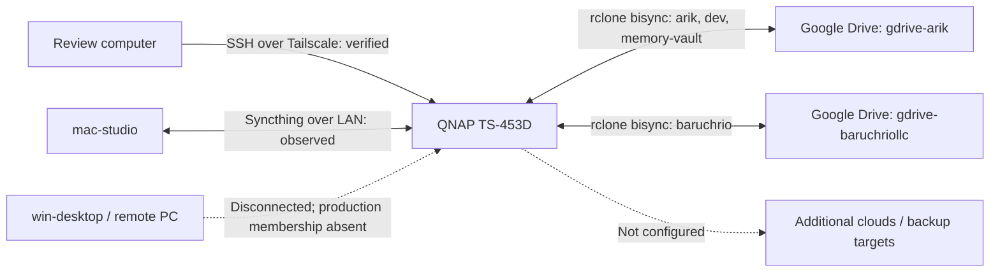
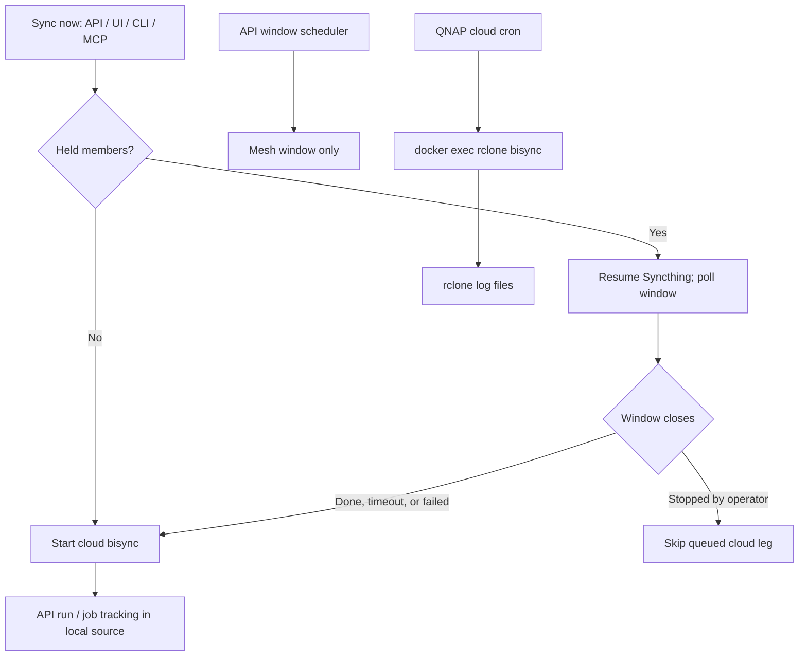
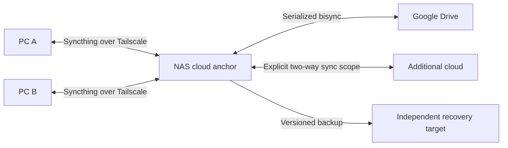
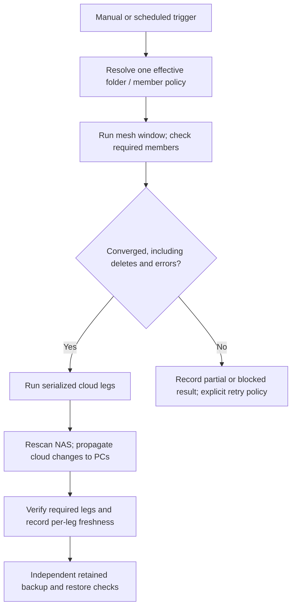

# Sync flow review — PCs, NAS, Tailscale, and clouds

Reviewed **2026-09-11, approximately 11:37–11:40 America/Los_Angeles**.
This is a dated operational snapshot, not a continuous health report.
Evidence came from read-only NAS access over Tailscale, deployed manifests,
Syncthing REST responses, QNAP cron, rclone logs, and the local source tree.
No sync, resync, configuration change, or restore was triggered by this review.

**Later enrollment update (September 11, approximately 13:41 PDT):** the
user booted the former Windows machine into Omarchy and requested enrollment.
Omarchy is now paired with the NAS over Tailscale and registered in all four
production folders. Initial sync is underway; see the
[Omarchy node runbook](runbooks/omarchy-node.md) for the resulting topology,
service, and verification. The snapshot and findings below describe the
earlier review; the missing-PC enrollment finding has since been addressed.

## Observed topology

The production deployment is Mac ↔ NAS ↔ Google Drive. Tailscale reaches the
NAS, but a working remote-PC sync leg was not demonstrated. Tailscale is the
network transport; Syncthing still needs device pairing and folder membership.
Cloud transfers use rclone and provider APIs; clouds are not Tailscale peers.

Solid edges are observed connections or configured jobs with successful log
evidence. Dashed edges are missing integration, not active data paths.

- Syncthing connected Mac `192.168.1.32:22000` and NAS `192.168.1.10:22000`.
- NAS Tailscale address `100.106.136.81` was reachable by SSH.
- Windows API `http://10.211.55.9:8384` timed out from the API container.
  That manifest points to a Mac-local Parallels network. An offline Windows
  peer appeared in Tailscale, but its identity was not established as
  `win-desktop`; do not substitute its address without verifying identity.
- All four live production folders contain only Mac and NAS Syncthing devices.
- `gdrive` is configured as another Drive remote, but no corresponding live
  production-folder leg was observed. No non-Drive rclone remote was present.

## Folder paths, timing, and health

Cloud paths below are relative to the named remote. These are independent
NAS-to-cloud jobs, not a PC-to-PC-to-Drive chain.

| Folder | Mac path | NAS path | Cloud destination | Cloud cron, NAS local time |
|---|---|---|---|---|
| arik | `/Users/ericbaruch/Arik` | `/share/Arik` | `gdrive-arik:/` | 04:00 daily |
| dev | `/Users/ericbaruch/dev` | `/share/dev` | `gdrive-arik:dev` | 02:00 daily |
| baruchrio | `/Users/ericbaruch/BaruchRio` | `/share/BaruchRio` | `gdrive-baruchriollc:/` | 03:00 daily |
| memory-vault | `/Users/ericbaruch/memory-vault` | `/share/CACHEDEV1_DATA/memory-vault` | `gdrive-arik:memory-vault` | 01:30 daily |

Arik's live cloud filter excludes `/dev/` and `/memory-vault/`, keeping those
separate cloud legs out of the Drive-root job. Preserve these boundaries when
changing filters or adding members.

| Folder | Mesh evidence | Cloud evidence on September 11 |
|---|---|---|
| dev | Latest completed NAS window timed out after 60 minutes; last recorded need: 52,569 files, 1,288,793,924 bytes, 52,600 errors | Successful at 03:42; elapsed 1h42m |
| arik | Repeated 90-minute timeouts; latest completed window recorded 10 needed files, 9,788,179 bytes, 4 errors; Mac had 2 unresolved deletions | 04:00 cron failed on changed filters; separate resync succeeded at 11:31 |
| baruchrio | NAS idle with no incoming need; Mac had 13 unresolved deletions | Successful at 03:05 |
| memory-vault | NAS idle with 1 needed deletion and 1 pull error | Successful at 01:37 |

Times above are converted to America/Los_Angeles; rclone log timestamps were
UTC. Outstanding counts for paused folders come from their last window, not
the zero-valued status response returned while paused. A successful cloud run
establishes that leg's result, not equality across every PC and cloud.

The NAS `memory-vault` deletion error names `@Recycle`; Mac `arik` errors name
directories under `compose/vaultwarden`. Both report directories containing
ignored files. These are not evidence that the ignored contents are safe to
delete. File-by-file equality and recovery were not tested.

## How execution currently works

There are two schedulers. SyncCenter's API schedules Syncthing windows; QNAP
cron invokes rclone directly. Cron does not wait for mesh completion.

This diagram describes the reviewed local implementation. Deployment and
source are not proven equivalent: live `/jobs` returned empty, while live
`/runs` ended on August 25 despite September 11 cloud cron successes.

## Findings and required follow-up

### 1. Incomplete mesh data can still reach a successful cloud job

Repeated `dev` and `arik` timeouts leave changes outstanding. QNAP cron is
independent of these windows. The local [Sync now implementation](../apps/api/src/lib/sync-now.ts)
also proceeds after timeout or failure; its tests explicitly require this.
Treat this as current partial-progress behavior, not an end-to-end freshness
guarantee. Define whether a failed mesh leg should block cloud work or allow
an explicitly partial run, and report that choice consistently.

### 2. Remote-PC enrollment is incomplete

Establish the intended PC's identity and Tailscale route, pair its Syncthing
device, and add paths for each intended folder. Verify both the API route
from the NAS container and the data connection between devices. A Tailscale
peer entry alone does not add a sync member.

### 3. Manual and scheduled cloud policy differ

The [schedule builder](../packages/apply-planner/src/schedule.ts) merges
per-member bisync overrides and maps `conflict.policy` to rclone flags.
The [manual trigger](../apps/api/src/lib/bisync-service.ts) translates only
`m.bisync.flags`. It omits those overrides and the unified conflict policy.
With the production manifests, cron chooses `newer`; manual requests can use
rclone's default `none`. Use a shared effective configuration resolver for
both paths, including conflict handling, filters, paths, and workdir.

### 4. Window completion omits deletion and error checks

The [window engine](../apps/api/src/lib/sync-windows.ts) checks idle state,
`needBytes === 0`, and `needFiles === 0`, then completion of connected peers.
It does not require zero needed deletions or errors; disconnected peers are
excluded and failed peer accounting falls back to local completion. Include
these conditions in completion reporting, and distinguish offline members
from confirmed convergence.

### 5. Cloud cron is outside the job ledger

Cron writes `/config/logs/<folder>-bisync.log` in `rclone-rcd`; these executions
do not pass through API run tracking. Report last attempt, last successful
completion, exit status, and age per leg, including cron. An empty job list
or old successful API run must not imply current cloud health.

### 6. Filter changes and overlapping maintenance need coordination

Arik's changed-filter rejection was followed by a successful separate resync;
this review did not perform that repair. Filter rollout needs a reviewed
baseline transition, not an unconditional resync on every scheduled run.
The persistent live baseline directory is `/config/bisync-workdir`, backed by
the NAS bind mount. Preserve it across container recreation.

Sunday Drive-root dedupe and `dev` bisync both start at 02:00 against overlapping
cloud content. Serialize overlapping maintenance and sync operations. Merely
spacing start times is insufficient: today's `dev` run lasted 1h42m.

### 7. Sync versioning does not cover all recovery paths

Thirty-day staggered versioning was enabled on both live Syncthing nodes.
Syncthing versions changes received from other devices, not local writes
made by rclone. All configured Drive remotes have `skip_gdocs = true`;
Google-native document content is outside these legs. No additional cloud
backup target was configured in this deployment. Define independent retention,
exports for Google-native documents, and restore verification before claiming
complete backup coverage.

See [Syncthing versioning](https://docs.syncthing.net/users/versioning.html)
and [rclone bisync](https://rclone.org/bisync/) for engine behavior.

### 8. Network exposure and deployment manifests differ

The live NAS publishes Syncthing GUI port 8384 on `0.0.0.0`, while rclone RC
5572 is bound to loopback. Syncthing devices use dynamic addresses; a
Tailscale-only transport policy was not established. The checked-in Compose
file also differs from live mounts and port bindings. Reconcile deployment
documentation and explicitly select LAN/Tailscale reachability. Internet
exposure, firewall rules, and tailnet ACLs were not audited.

## Target flow — proposed, not deployed

Keep NAS as the cloud anchor. Additional clouds attach as separate legs with
explicit folder scope and a sync or backup role; they do not require a serial
Drive-to-cloud chain. Validate each backend's semantics before enabling it.

The return leg matters: cloud-originated changes land on the NAS and then
need a Syncthing scan/window to reach PCs. Completing the upload leg alone
does not complete a bidirectional mesh cycle.

## Validation and implementation order

The review ran 42 focused tests across `sync-now`, `bisync-request`, schedule,
and conflict suites: all passed. These confirm existing behavior, including
cloud execution after a timeout; they do not certify live data equality.

1. Resolve mesh backlog and ignored-directory deletion errors without blindly
   deleting ignored contents.
2. Verify remote-PC identity, Tailscale reachability, pairing, and membership.
3. Unify manual and scheduled policy resolution and per-leg monitoring.
4. Coordinate filter transitions, maintenance, cloud jobs, and return scans.
5. Add explicitly scoped cloud or backup members and test recovery.
