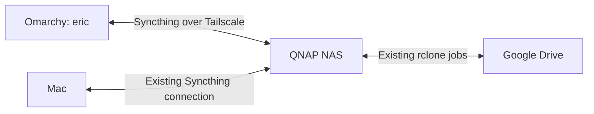

# Omarchy mesh node

Enrolled September 11, 2026. This is the Arch/Omarchy boot of the machine
previously discussed as Windows 11. It has its own Syncthing identity; the
inactive `win-desktop` manifest was retained rather than reusing its identity.

## Connection and service

- SSH: `ssh eric@100.88.84.71` (Tailscale SSH authentication may be required).
- MagicDNS: `omarchy.tail2d2c60.ts.net`.
- Syncthing API/GUI: `https://100.88.84.71:8384`, using its self-signed certificate.
- Data listener: `tcp://100.88.84.71:22000`.
- Binary: `/home/eric/.local/bin/syncthing`, pinned to v2.1.5 at enrollment,
  matching the existing mesh version. Official release archive checksum verified.
- Configuration and database: `/home/eric/.local/state/syncthing`.
- User service: `/home/eric/.config/systemd/user/syncthing.service`.
- `systemctl --user enable --now syncthing` and user lingering are enabled,
  so the service can run after logout and at boot.

The service runs as `eric`, without sudo. Its listeners bind only to the
Tailscale IPv4 address; global/local discovery, relays, and NAT traversal are
disabled on this node. The NAS peer uses an explicit Tailscale address.
Other mesh nodes' network settings were not changed.

The NAS–Omarchy peer is configured for one connection (`numConnections: 1`)
on both ends. During enrollment, repeated replacement of index handlers
interrupted transfers after a window restart. Pausing and resuming only the
new NAS peer and limiting that pair to one connection restored transfers.

GUI username is `eric`; its generated password is stored only on Omarchy at
`/home/eric/.local/state/syncthing/gui-password` with mode 0600. Retrieve it
privately over SSH if needed; do not paste credentials into issues or logs.

## Membership and data flow



Omarchy is paired with the NAS. Mac changes reach Omarchy through the NAS;
there is no direct Omarchy–Mac pairing. Google Drive remains attached to the
NAS and requires no cloud credentials on Omarchy.

| Folder | Omarchy path | NAS availability |
|---|---|---|
| arik | `/home/eric/Arik` | Scheduled NAS windows, plus manual windows |
| dev | `/home/eric/dev` | Scheduled NAS windows, plus manual windows |
| baruchrio | `/home/eric/BaruchRio` | Scheduled NAS windows, plus manual windows |
| memory-vault | `/home/eric/memory-vault` | Realtime |

All four Omarchy folders are send-receive, with filesystem watching enabled,
daily full rescans, ignored permissions, and 30-day staggered versioning.
Existing NAS ignore rules were written before the folders were shared.
Omarchy's folders remain active; NAS schedules control when held folders
can exchange data. An idle folder with zero global files before its first
peer index arrives is not evidence that initial sync is complete.

## SyncCenter registration

The local and deployed configuration repositories contain `hosts/omarchy.yaml`
and an `omarchy` path in each of the four folder manifests. The host schema
supports `install_method: user-systemd`.

The API key and device ID are SOPS-encrypted in `secrets/omarchy.enc.yaml`.
The NAS deployment `.env` contains `SC_HOST_API_KEY_OMARCHY`; when regenerating
the deployment environment, merge that variable from the Omarchy secret file
alongside the existing API environment secrets. Do not replace the entire
environment with only this one file.

The SyncCenter API container was recreated to load the key. Its health check
and `/hosts/omarchy/status` both returned HTTP 200, with Omarchy online.
The API reload interrupted Arik window 331; a replacement mesh-only window
332 was opened successfully. No cloud job was triggered by enrollment.

## Verification and maintenance

At enrollment, the observed data connection was
`100.106.136.81:22000` and both `arik` and `memory-vault` were receiving files
without reported Omarchy errors. Initial sync was still in progress; `dev`
and `baruchrio` awaited NAS windows. Available disk space before enrollment
was approximately 195 GB.

Useful commands on Omarchy:

```sh
systemctl --user status syncthing
journalctl --user -u syncthing --since '15 minutes ago'
loginctl show-user eric -p Linger
df -h /home/eric
```

Use SyncCenter's host/folder status and window history to check progress.
The [full sync review](../Sync-Flow-Review.md) still applies to pre-existing
NAS backlog, deletion errors, cloud policy parity, and monitoring gaps.
Enrollment does not resolve those issues or establish complete data equality.
